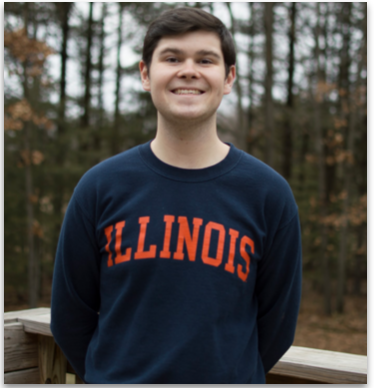

Welcome to the professional website of John Fetscher, Consulting Intern at Primera Engineers and Project Manager of Phoenix - a University of Illinois upstart clothing company.

<p align="center">
  
</p>

# Biography

Hi, my name is John Fetscher and I am a senior studying Statistics at the University of Illinois at Urbana-Champaign. Outside of my studies, I serve as a Consulting Intern for Primera Engineers, Project Manager of Phoenix, and as an Undergraduate Research Assistant for the Gies College of Business. Upon graduation in August, I plan to enter into the field of Consulting, using my technical background in statistics to improve data analysis and collection methods. Within consulting, I am interested in working on projects related to utilities, sustainability, and retail markets.

# Blog

## STAT 385: Statistics Programming Methods

### Data Visualization

A main component of my coursework in STAT 385 focuses on methods of data visualization in R. Below is a visual pertaining to waiting and eruption times for Old Faithful geyser at Yellowstone National Park. The histogram shows the spread of waiting times while the scatterplot depicts the relationship between waiting and eruption times.

```r
par(mfrow = c(1,2))
hist(x = faithful$waiting, main = "Histogram of Waiting Time", xlab = "Waiting Time (mins)", 
     breaks = 15, border = "dodgerblue", probability = TRUE, ylim = c(0,.05), xlim = c(40,100))
box()
grid()
plot(faithful$waiting, faithful$eruptions, main = "Waiting Time vs. Eruption Time", 
     xlab = "Waiting Time (mins)", ylab = "Eruption Time (mins)", col = "darkmagenta")
box()
grid()
```

<p align="center">
  
</p>

### Programming Methods

Another component of STAT 385 is learning different programming methods. Recently, we learned about vectorization and its necessity in developing efficient code. Below is an example of a vectorized function which quickly calculates which objects within an array are longer than 8 characters.

```r
long_name_vec <- function(vec){
  return(vec[nchar(vec) > 8])
}
```

# [CV/Resume](https://drive.google.com/file/d/18PcPykiAO_hySSiGjfotxsO5GkMMWQ-X/view?usp=sharing)

# Professional Accounts
* [**LinkedIn**](https://www.linkedin.com/in/john-fetscher-375401152/)
* [**GitHub**](https://github.com/jfetscher)
* [**Phoenix**](https://phxfashion.bigcartel.com)

# Relevant Coursework
* [**STAT 385: Statistics Programming Methods**](https://courses.illinois.edu/schedule/2020/spring/STAT/385)
* [**STAT 400: Statistics and Probability I**](https://courses.illinois.edu/schedule/2020/spring/STAT/400)
* [**STAT 410: Statistics and Probability II**](https://courses.illinois.edu/schedule/2020/spring/STAT/410)
* [**STAT 420: Methods of Applied Statisics**](https://courses.illinois.edu/schedule/2020/spring/STAT/420)
* [**STAT 425: Applied Regression and Design**](https://courses.illinois.edu/schedule/2020/spring/STAT/425)
* [**STAT 440: Statistical Data Management**](https://courses.illinois.edu/schedule/2020/spring/STAT/440)
* [**STAT 443: Professional Statistics**](https://courses.illinois.edu/schedule/2020/spring/STAT/443)
